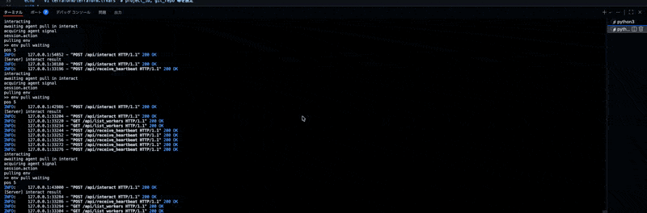

# クラウド評価の実行

実験のたびに実行する手順です。環境構築は済んでいる前提: [クラウド環境構築](setup.md)

---

## Step 1: モデル切替

```bash
# switch-model.sh を編集してモデル名・HFトークンを設定
vi ~/AgentBench_Small_For_LLM2025/scripts/eval/switch-model.sh
```

```bash
# ---- ここを編集 ----
VLLM_MODEL="your-org/your-model"
HF_TOKEN="hf_xxxxxxxxxxxxx"    # private モデルの場合
# ---------------------
```

```bash
# モデル切替 (.env + config 更新 → サービス再起動)
sudo bash ~/AgentBench_Small_For_LLM2025/scripts/eval/switch-model.sh
```

---

## Step 2: タスクサーバー起動

```bash
cd ~/AgentBench_Small_For_LLM2025
bash scripts/eval/run-task-server.sh
```

5000 番台のポートに残っているプロセスを自動で停止してからサーバーを起動します。
フォアグラウンドで動き続けるため、**別のターミナル**で Step 3 以降を実行してください。

> **VSCode の場合:** ターミナル右上の分割ボタン、または `Ctrl+Shift+5` でターミナルを複製できます。
>
> 

---

## Step 3: 評価実行

```bash
cd ~/AgentBench_Small_For_LLM2025
python3 -m src.assigner -c configs/assignments/default.yaml 2>&1 | tee outputs/execution.log
```

- 実行ログ: `outputs/execution.log`
- 結果: `outputs/` 以下

### 前回の結果をクリアして再実行する場合

```bash
rm -rf outputs/*
python3 -m src.assigner -c configs/assignments/default.yaml 2>&1 | tee outputs/execution.log
```

---

## デバッグ: 単一タスクだけ実行する

ALFWorld / DBBench を個別に動かしたい場合は、`--config` でデバッグ用設定を指定します。
同時実行数は通常実行と同じです（ALF: 5並列, DB: 1並列, エージェント: 5並列）。

### ALFWorld だけ

```bash
# タスクサーバー (別ターミナル)
bash scripts/eval/run-task-server.sh alf

# アサイナー
python3 -m src.assigner -c configs/assignments/debug_alf.yaml 2>&1 | tee outputs/execution.log
```

### DBBench だけ

```bash
# タスクサーバー (別ターミナル)
bash scripts/eval/run-task-server.sh db

# アサイナー
python3 -m src.assigner -c configs/assignments/debug_db.yaml 2>&1 | tee outputs/execution.log
```

---

## Step 4: 結果確認

```bash
ls ~/AgentBench_Small_For_LLM2025/outputs/
```

ローカルにコピー:

```bash
gcloud compute scp --recurse \
  agentbench-eval:~/AgentBench_Small_For_LLM2025/outputs/ ./outputs/ \
  --zone YOUR_ZONE --project YOUR_PROJECT_ID
```

---

## Step 5: タスクサーバー停止

タスクサーバーを起動したターミナルで `Ctrl+C` を押してください。

---

## vLLM の状態確認・監視

```bash
# サービスの状態
sudo systemctl status agentbench-vllm

# コンテナの確認
sudo docker ps | grep vllm

# ログの確認
sudo journalctl -u agentbench-vllm -n 50

# ログをリアルタイムで追跡
sudo journalctl -u agentbench-vllm -f
```

### vLLM の手動再起動

```bash
sudo systemctl restart agentbench-vllm
```

---

## トラブルシューティング

### "0 samples remaining"

前回の結果がキャッシュされています:

```bash
rm -rf outputs/*
python3 -m src.assigner -c configs/assignments/default.yaml 2>&1 | tee outputs/execution.log
```

### ALFWorld: `FileNotFoundError` / `PermissionError`: `data/alfworld/logic/alfred.pddl`

alfworld ランタイムデータのシンボリックリンクが未作成、またはリンク先にアクセスできません。
`setup2.sh` を再実行してください (sudo 不要):

```bash
bash ~/AgentBench_Small_For_LLM2025/scripts/setup/setup2.sh
```

### vLLM 接続エラー

```bash
sudo systemctl status agentbench-vllm
sudo journalctl -u agentbench-vllm -n 50
docker ps | grep vllm
```
